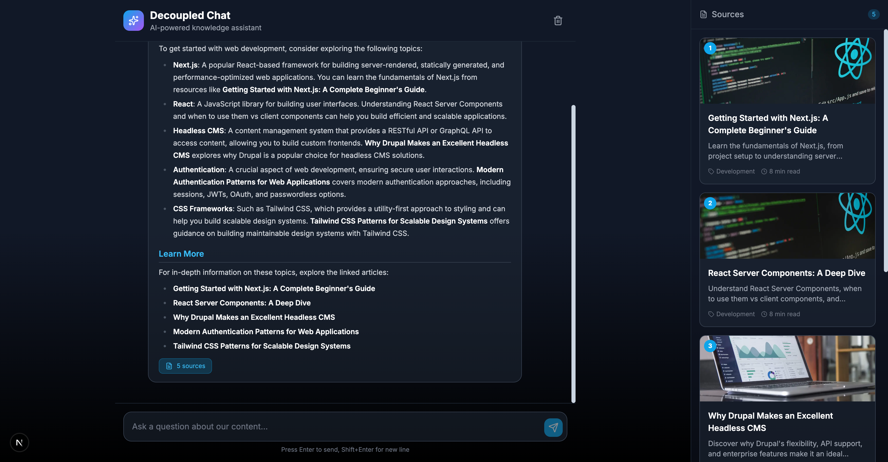

# Decoupled Chat

AI-powered chat assistant built with Next.js, Drupal (via Decoupled.io), Pinecone, and Groq. A Perplexity-style chat interface that can search your content and provide answers with sources.



## Features

- **Conversational AI**: Natural language chat powered by Groq (Llama 4)
- **Source Citations**: Answers include references to relevant articles
- **Semantic Search**: Uses AI embeddings to find relevant content
- **Tool Calling**: LLM decides when to search the knowledge base
- **Markdown Support**: Rich formatting in responses
- **Beautiful UI**: Clean, dark theme with 2-column layout
- **No OpenAI Required**: Uses Pinecone's built-in inference for embeddings

## How It Works

1. **User asks a question** in the chat interface
2. **Groq LLM decides** if it needs to search the knowledge base
3. **Semantic search** finds relevant articles via Pinecone
4. **LLM generates response** with context from search results
5. **Sources displayed** in the sidebar for reference

## Quick Start

### 1. Run the Setup Script

The interactive setup script will guide you through:
- Creating a Drupal space on Decoupled.io
- Importing sample articles
- Configuring Pinecone for semantic search
- Configuring Groq for AI chat
- Indexing content

```bash
npm install
npm run setup
```

### 2. Start Development Server

```bash
npm run dev
```

Open [http://localhost:3000](http://localhost:3000) to start chatting.

## Prerequisites

You'll need accounts and API keys from:

### Decoupled.io (Content Management)
- Sign up at [decoupled.io](https://decoupled.io)
- Authenticate via CLI: `npx decoupled-cli@latest auth login`

### Pinecone (Vector Database + Embeddings)
- Sign up at [pinecone.io](https://pinecone.io)
- Create a free account and get your API key
- Pinecone provides both storage AND embeddings - no OpenAI needed!

### Groq (AI Chat)
- Sign up at [console.groq.com](https://console.groq.com)
- Get a free API key for fast LLM inference

## Environment Variables

| Variable | Description | Required |
|----------|-------------|----------|
| `DRUPAL_BASE_URL` | Your Drupal space URL | Yes |
| `DRUPAL_CLIENT_ID` | OAuth client ID | Yes |
| `DRUPAL_CLIENT_SECRET` | OAuth client secret | Yes |
| `PINECONE_API_KEY` | Pinecone API key | Yes |
| `PINECONE_INDEX` | Pinecone index name | No (default: decoupled-chat) |
| `GROQ_API_KEY` | Groq API key | Yes |

## Project Structure

```
decoupled-chat/
├── app/
│   ├── api/
│   │   ├── chat/             # Chat API with Groq + tool calling
│   │   ├── graphql/          # Drupal GraphQL proxy
│   │   ├── revalidate/       # Cache revalidation
│   │   └── search/           # Search API endpoint
│   ├── articles/[slug]/      # Article detail pages
│   ├── components/
│   │   ├── ChatInput.tsx     # Message input component
│   │   ├── ChatMessage.tsx   # Message display with markdown
│   │   ├── Header.tsx
│   │   ├── SetupGuide.tsx    # Setup instructions
│   │   └── SourceCard.tsx    # Article source card
│   ├── globals.css
│   ├── layout.tsx
│   └── page.tsx              # Chat interface
├── lib/
│   ├── apollo-client.ts      # GraphQL client
│   ├── pinecone.ts           # Pinecone operations + inference
│   ├── queries.ts            # GraphQL queries
│   └── types.ts              # TypeScript types
├── data/
│   └── chat-content.json     # Sample articles
└── scripts/
    ├── setup.ts              # Interactive setup
    └── index-content.ts      # Content indexer
```

## Commands

| Command | Description |
|---------|-------------|
| `npm run dev` | Start development server |
| `npm run build` | Build for production |
| `npm run setup` | Interactive setup wizard |
| `npm run setup-content` | Import sample content to Drupal |
| `npm run index` | Index content in Pinecone |
| `npm run index:reset` | Clear index and re-index all content |

## Re-indexing Content

When you add or update content in Drupal, re-index to update search:

```bash
npm run index
```

## Customization

### Adding More Content

1. Add articles via the Drupal admin interface
2. Or modify `data/chat-content.json` and run `npm run setup-content`
3. Re-index with `npm run index`

### Changing the AI Model

Edit `app/api/chat/route.ts` to use a different Groq model:
```typescript
const GROQ_MODEL = 'meta-llama/llama-4-scout-17b-16e-instruct'
```

### Styling

The project uses Tailwind CSS with a dark theme. Modify `tailwind.config.js` and `globals.css` for custom colors.

### Search Behavior

Adjust search parameters in `lib/pinecone.ts`:
- `topK`: Number of results to return
- Embedding model: Uses `llama-text-embed-v2` via Pinecone inference

## Architecture

```
┌─────────────────────────────────────────────────────────────┐
│                    User Chat Message                         │
└─────────────────────────┬───────────────────────────────────┘
                          │
                          ▼
┌─────────────────────────────────────────────────────────────┐
│                    Next.js Frontend                          │
│  ┌───────────────────────────────────────────────────────┐  │
│  │                   /api/chat                            │  │
│  │  1. Receive message + conversation history             │  │
│  │  2. Send to Groq with tool definitions                 │  │
│  │  3. If tool call: search Pinecone for articles         │  │
│  │  4. Return response with sources                       │  │
│  └───────────────────────────────────────────────────────┘  │
└─────────────────────────────────────────────────────────────┘
          │                               │
          ▼                               ▼
┌───────────────────┐         ┌───────────────────────────────┐
│       Groq        │         │          Pinecone             │
│  ┌─────────────┐  │         │  ┌─────────┐  ┌────────────┐  │
│  │   Llama 4   │  │         │  │Inference│  │  Vectors   │  │
│  │  (Chat AI)  │  │         │  │   API   │──│  Database  │  │
│  └─────────────┘  │         │  └─────────┘  └────────────┘  │
└───────────────────┘         └───────────────────────────────┘
```

## Demo Mode

Demo mode allows you to showcase the application without connecting to Drupal, Pinecone, or Groq. It displays simulated chat responses with mock articles.

### Enable Demo Mode

Set the environment variable:

```bash
NEXT_PUBLIC_DEMO_MODE=true
```

Or add to `.env.local`:
```
NEXT_PUBLIC_DEMO_MODE=true
```

### What Demo Mode Does

- Shows a "Demo Mode" banner at the top of the page
- Returns simulated chat responses with helpful demo content
- Displays mock articles in the sources sidebar (clickable)
- Article detail pages show full mock content
- No backend services required

### Removing Demo Mode

To convert to a production app with real data:

1. Delete `lib/demo-mode.ts`
2. Delete `data/mock/` directory
3. Delete `app/components/DemoModeBanner.tsx`
4. Remove `DemoModeBanner` from `app/layout.tsx`
5. Remove demo mode checks from `app/api/chat/route.ts`
6. Remove demo mode checks from `app/api/config/route.ts`
7. Remove demo mode checks from `app/articles/[slug]/page.tsx`

## Deployment

### Vercel

1. Push to GitHub
2. Import in Vercel
3. Add environment variables (or set `NEXT_PUBLIC_DEMO_MODE=true` for demo)
4. Deploy

### Important Notes

- Run `npm run index` after deploying to index content
- Pinecone indexes persist - you don't need to re-index on every deploy
- Groq and Pinecone both offer free tiers

## Support

- [Decoupled.io Documentation](https://decoupled.io/docs)
- [Groq Documentation](https://console.groq.com/docs)
- [Pinecone Documentation](https://docs.pinecone.io)
- [Next.js Documentation](https://nextjs.org/docs)

## License

MIT
